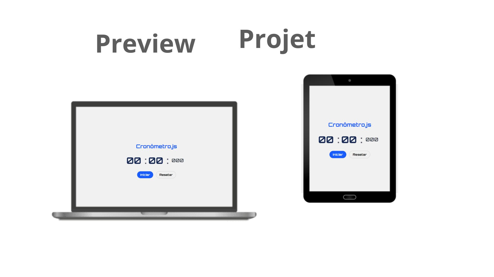

# CronometroJs ⏱️

Cronômetro Web desenvolvido com HTML, CSS e JAVASCRIPT.

## 🔥 Introdução
Neste projeto foi feito toda estrutura e estilo com HTML e CSS, e com o JAVASCRIPT demos as devidas funcionalidades do cronometro.

No projeto foi usado funcoes, variaveis, uma logica para manter o tempo correto e exibi-lo em um formato legivel e tambem intervalos de tempo para criar um cronometro que possa ser iniciado, pausado e reiniciado.

### 📦 Tecnologias usadas

* 
* 
* 
